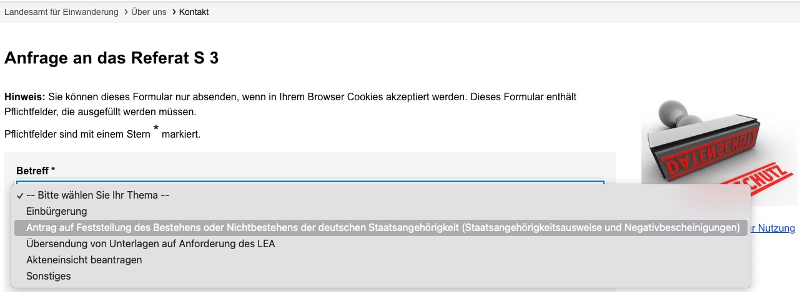

# Получить Negativbescheinigung

* TOC
{:toc}

## Шаг 1: Подготовка документов

1. **Соберите все нужные документы** в один PDF файл. В PDF файл должны входить:
   - Копия паспорта
   - Копия Aufenthaltstitel
   - [Antragsformular](https://docs.google.com/document/d/1bLAyp23piqqyPrCeiw-gJRHhRcRGY4oeO8POlzoJjqM/edit){:target="_blank"}
   - Копия свидетельства о рождении (Geburtsurkunde)

## Шаг 2: Заполнение онлайн формуляра

1. Идите на страницу: <https://www.berlin.de/einwanderung/ueber-uns/kontakt/formular.1394756.php>
2. Заполните все необходимые поля в формуляре.
3. В разделе темы выберите наиболее подходящий 

## Шаг 3: Отправка формы

1. **Отправьте заполненный формуляр** вместе с прикрепленным PDF файлом.

## Шаг 4: Ожидание уведомления о стоимости

1. **Ожидайте уведомления о стоимости.** Уведомление будет отправлено вам отдельно по почте.
2. После получения уведомления, произведите оплату.

## Шаг 5: Ожидание ответа

1. **Ожидайте ответа от LEA.** Среднее время ответа составляет 2-4 недели.
2. Если у вас есть запланированная поездка в другую страну, укажите это в формуляре и прикрепите билет для ускорения процесса.

## Дополнительная информация

- По опыту, ожидание может занять до 3 месяцев, но процесс сейчас должен быть быстрее.
- Некоторые пользователи недавно взаимодействовали с LEA и получили Negativbescheinigung без необходимости термина.

Вот полезные ссылки:
- [Формуляр для запроса](https://www.berlin.de/einwanderung/ueber-uns/kontakt/formular.1394756.php)
- [Страница с информацией о процессах LEA](https://www.berlin.de/einwanderung/einbuergerung/)

## Примеры из опыта

- **Пользователь Feri:** LEA обработало заявку за год.
- **Пользователь Almer:** Среднее время получения ответа составляет 2-4 недели, можно ускорить процесс, указав о наличии запланированной поездки и предоставив билет.

## Контакты

Если возникнут вопросы, воспользуйтесь контактной формой на сайте LEA.

---

Надеемся, данный гид поможет вам успешно получить Negativbescheinigung.

